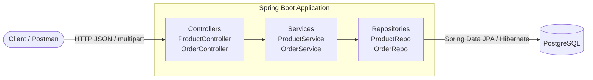
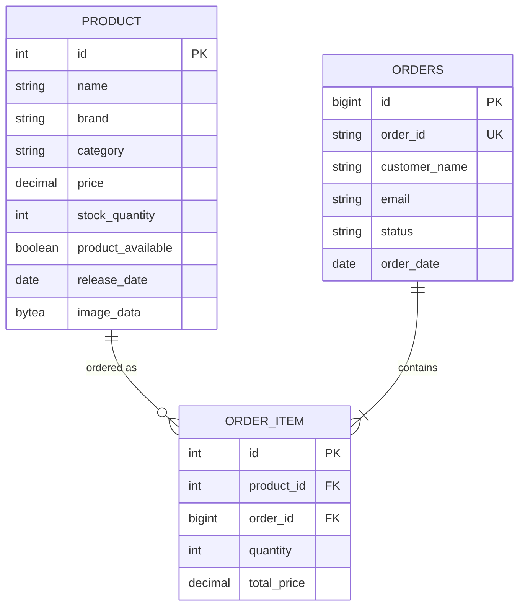
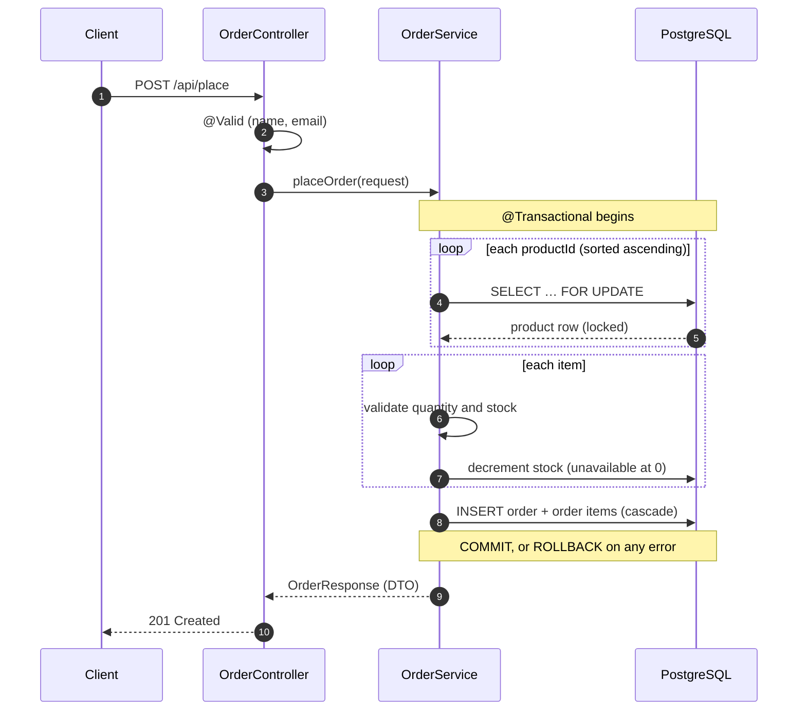

<div align="center">

# SpringEcom

**A production-style e-commerce REST API built with Spring Boot 4, Spring Data JPA and PostgreSQL**

Product catalogue with image upload, full-text style search, and a concurrency-safe order engine
that locks stock rows, validates inventory and rolls back atomically on failure.


[Features](#features) •
[Architecture](#architecture) •
[API Reference](#api-reference) •
[Getting Started](#getting-started) •
[Order Engine](#how-the-order-engine-works) •
[Testing](#testing-with-postman)

</div>

---

## Features

| | Feature | Details |
|---|---|---|
| **Catalogue** | Product CRUD | Create, read, update and delete products |
| **Media** | Image upload | `multipart/form-data` upload, image stored in PostgreSQL as a `@Lob` |
| **Search** | Keyword search | Case-insensitive match across name, description, brand and category (JPQL) |
| **Orders** | Order placement | Multi-item orders with per-line pricing and a generated business key (`ORDXXXXXXXX`) |
| **Safety** | Concurrency control | Pessimistic row locks (`SELECT … FOR UPDATE`) in sorted order, so no overselling and no deadlocks |
| **Integrity** | Atomic transactions | Any failure rolls back every stock change made in that order |
| **Inventory** | Auto availability | Product marked unavailable at 0 stock and available again when restocked |
| **Validation** | Request validation | Bean Validation (`@NotBlank`, `@Email`) plus domain checks with clear `400` / `404` responses |
| **Design** | DTO boundary | Orders use Java `record` DTOs, so entities are never exposed in order responses |

---

## Architecture



### Data model



### Project structure

```
src/main/java/com/akshat/SpringEcom
├── controller
│   ├── HelloController.java        # GET /hello health check
│   ├── ProductController.java      # product CRUD, image upload, search
│   └── OrderController.java        # place + list orders
├── service
│   ├── ProductService.java         # image handling, restock logic
│   └── OrderService.java           # locking, stock validation, transactions
├── repo
│   ├── ProductRepo.java            # JPQL search + PESSIMISTIC_WRITE lookup
│   └── OrderRepo.java              # JOIN FETCH query (no N+1)
├── model
│   ├── Product.java
│   ├── Order.java
│   ├── OrderItem.java
│   └── dto                         # OrderRequest / OrderResponse records
└── SpringEcomApplication.java
```

---

## API Reference

Base URL: `http://localhost:8080`

### Products

| Method | Endpoint | Description | Body | Success |
|:---:|---|---|---|:---:|
| `GET` | `/api/products` | List all products | — | `200` |
| `GET` | `/api/product/{id}` | Get a product by id | — | `200` / `404` |
| `POST` | `/api/product` | Create a product with image | `multipart/form-data` | `201` |
| `PUT` | `/api/product/{id}` | Update a product with image | `multipart/form-data` | `200` / `404` |
| `DELETE` | `/api/product/{id}` | Delete a product | — | `200` / `404` |
| `GET` | `/api/products/search?keyword=` | Search products | — | `200` |

### Orders

| Method | Endpoint | Description | Body | Success |
|:---:|---|---|---|:---:|
| `POST` | `/api/place` | Place an order | `application/json` | `201` |
| `GET` | `/api/orders` | List all orders with items | — | `200` |

<details>
<summary><b>Create product: multipart request</b></summary>

<br/>

Two form-data parts:

| Key | Type | Content-Type | Value |
|---|---|---|---|
| `product` | Text | `application/json` | JSON below |
| `imageFile` | File | auto | any `.jpg` / `.png` |

```json
{
  "id": 0,
  "name": "iPhone 15",
  "description": "128GB, Black",
  "brand": "Apple",
  "price": 69999.00,
  "category": "Mobile",
  "releaseDate": "22-09-2023",
  "productAvailable": true,
  "stockQuantity": 10
}
```

> `releaseDate` uses the `dd-MM-yyyy` format.

</details>

<details>
<summary><b>Place order: request and response</b></summary>

<br/>

**Request** `POST /api/place`

```json
{
  "customerName": "Akshat",
  "email": "akshat@example.com",
  "items": [
    { "productId": 1, "quantity": 2 },
    { "productId": 2, "quantity": 1 }
  ]
}
```

**Response** `201 Created`

```json
{
  "orderId": "ORD4024E8F5",
  "customerName": "Akshat",
  "email": "akshat@example.com",
  "status": "PLACED",
  "orderDate": "2026-10-07",
  "items": [
    { "productName": "iPhone 15", "quantity": 2, "totalPrice": 139998.00 },
    { "productName": "Galaxy S24", "quantity": 1, "totalPrice": 74999.00 }
  ]
}
```

</details>

<details>
<summary><b>Error responses</b></summary>

<br/>

| Scenario | Status |
|---|:---:|
| Blank `customerName` or invalid `email` | `400` |
| Empty `items` list | `400` |
| `quantity` ≤ 0 | `400` |
| Requested quantity exceeds stock | `400` |
| Unknown `productId` | `404` |

</details>

---

## How the order engine works

The core of the project is `OrderService.placeOrder`, written to stay correct when many customers buy the same product at the same time.



**Design decisions**

- **Pessimistic locking.** `@Lock(PESSIMISTIC_WRITE)` locks the product rows so two concurrent orders cannot both pass the stock check and oversell.
- **Sorted lock acquisition.** Rows are always locked in ascending id order, so two orders containing the same products in different order can never deadlock.
- **One transaction.** If item 3 of 3 fails validation, the stock already deducted for items 1 and 2 is rolled back automatically.
- **No N+1 queries.** `GET /api/orders` loads orders, items and products in a single `JOIN FETCH` query.

---

## Getting Started

### Prerequisites

- **Java 21+**
- **PostgreSQL** running on `localhost:5432`
- **Maven** (or use the bundled `mvnw` wrapper)

### 1. Clone

```bash
git clone https://github.com/<your-username>/SpringEcom.git
cd SpringEcom
```

### 2. Create the database

```sql
CREATE DATABASE "Akshat";
```

Tables are created automatically by Hibernate on first run (`ddl-auto=update`).

### 3. Set the database password

The password is read from an environment variable and is never committed.

```powershell
# Windows PowerShell
$env:DB_PASSWORD="your_postgres_password"
```

```bash
# macOS / Linux
export DB_PASSWORD=your_postgres_password
```

### 4. Run

```bash
./mvnw spring-boot:run        # macOS / Linux
mvnw.cmd spring-boot:run      # Windows
```

The API starts at **http://localhost:8080**. Check it with `GET /hello`.

---

## Testing with Postman

A ready-made collection is included in [`postman/SpringEcom.postman_collection.json`](postman/SpringEcom.postman_collection.json).

1. Open Postman, click **Import**, and select the file.
2. The collection uses a `{{baseUrl}}` variable that defaults to `http://localhost:8080`.
3. In **Create Product** and **Update Product**, select an image for the `imageFile` field.
4. Suggested flow: create products, then search, place an order, check stock went down, and try the error cases.

---

## Tech Stack

| Layer | Technology |
|---|---|
| Language | Java 21 (records, streams) |
| Framework | Spring Boot 4, Spring Web MVC |
| Persistence | Spring Data JPA, Hibernate 7 |
| Database | PostgreSQL |
| Validation | Jakarta Bean Validation |
| Build | Maven |
| Utilities | Lombok, Spring DevTools |
| API Testing | Postman |

---

## Roadmap

- [ ] Global exception handler with a consistent JSON error body
- [ ] Dedicated image endpoint (`GET /api/product/{id}/image`) to slim list responses
- [ ] Pagination and sorting on product listing
- [ ] Spring Security with JWT for admin-only product management
- [ ] Flyway database migrations
- [ ] Integration tests with Testcontainers
- [ ] Swagger / OpenAPI documentation
- [ ] Docker Compose for one-command setup

---

<div align="center">

**Built by [Akshat Raj](https://github.com/<your-username>)** · B.Tech CSE, KIIT University

If you found this project useful, consider giving it a ⭐

</div>
